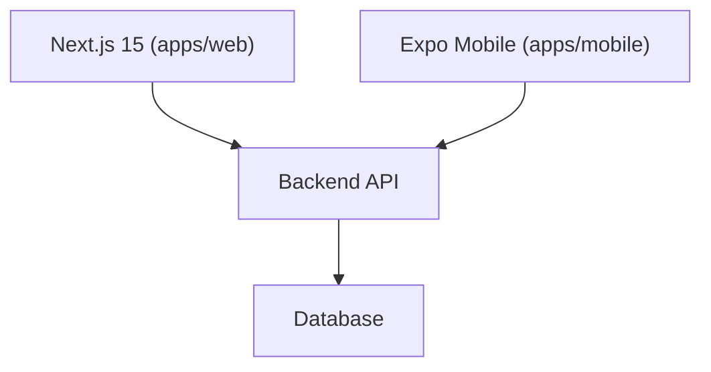

# Astute Insights — System Architecture

> Maintained by uMbhali. Uses Mermaid.js for all diagrams.

## Stack Overview



## Monorepo Structure

```
apps/
  web/      — Next.js 15 web application
  mobile/   — Expo mobile application
packages/
  types/    — Shared TypeScript types
  ui-tokens/ — Shared design tokens
```

_Update this file when new routes, schemas, or services are added._
