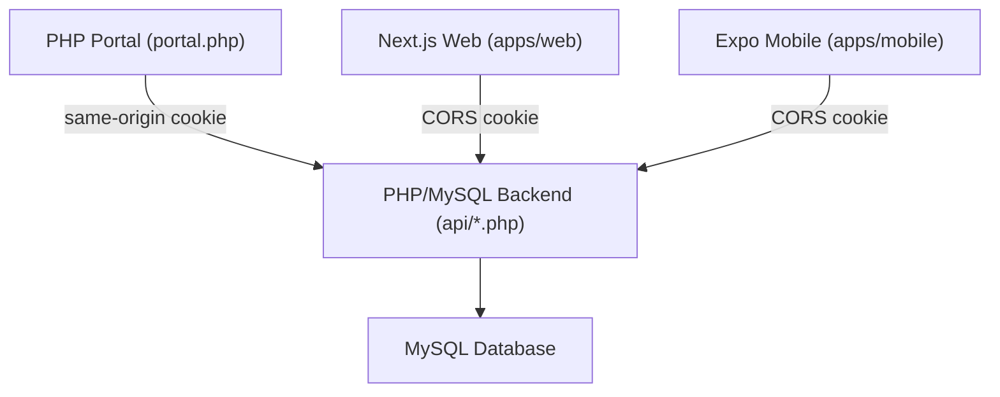
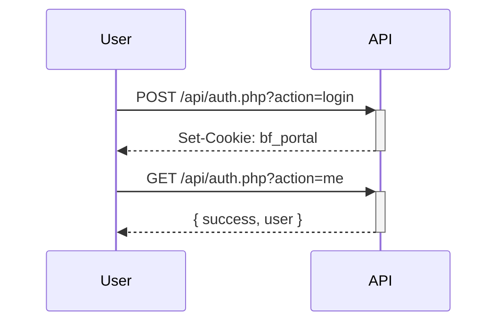

# BlackFire — System Architecture

> Maintained by uMbhali. Uses Mermaid.js for all diagrams.

## High-Level Architecture

## Authentication Flow

## API Endpoints

| File | Purpose |
|------|---------|
| `api/auth.php` | Login, logout, session validation |
| `api/tasks.php` | Task management |
| `api/callouts.php` | Callout workflow |
| `api/quotes.php` | Quote generation |
| `api/invoices.php` | Invoice management |
| `api/clients.php` | Client records |
| `api/users.php` | User management |
| `api/dashboard.php` | Dashboard aggregates |
| `api/finance.php` | Financial reporting |

## RBAC Surface

The current portal role surface accepted by the user admin flow includes:

| Role |
|------|
| sysadmin |
| admin |
| manager |
| admin_clerk |
| call_logger |
| junior_tech |
| senior_tech |
| client_support |
| viewer |
| client |
| finance |
| safety_officer |
| inspector |

`api/users.php` and the shared contract/types should stay aligned with this list while the RBAC migration work continues.

_Update this file when new endpoints or database schemas are added._
