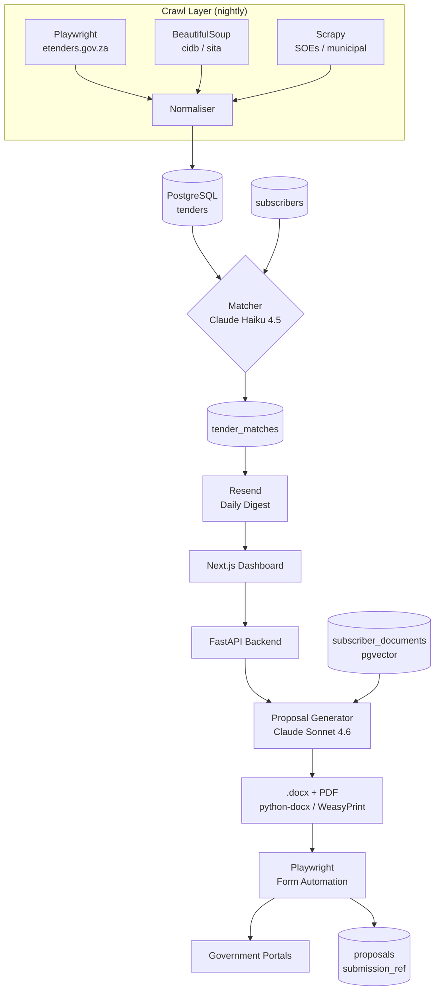
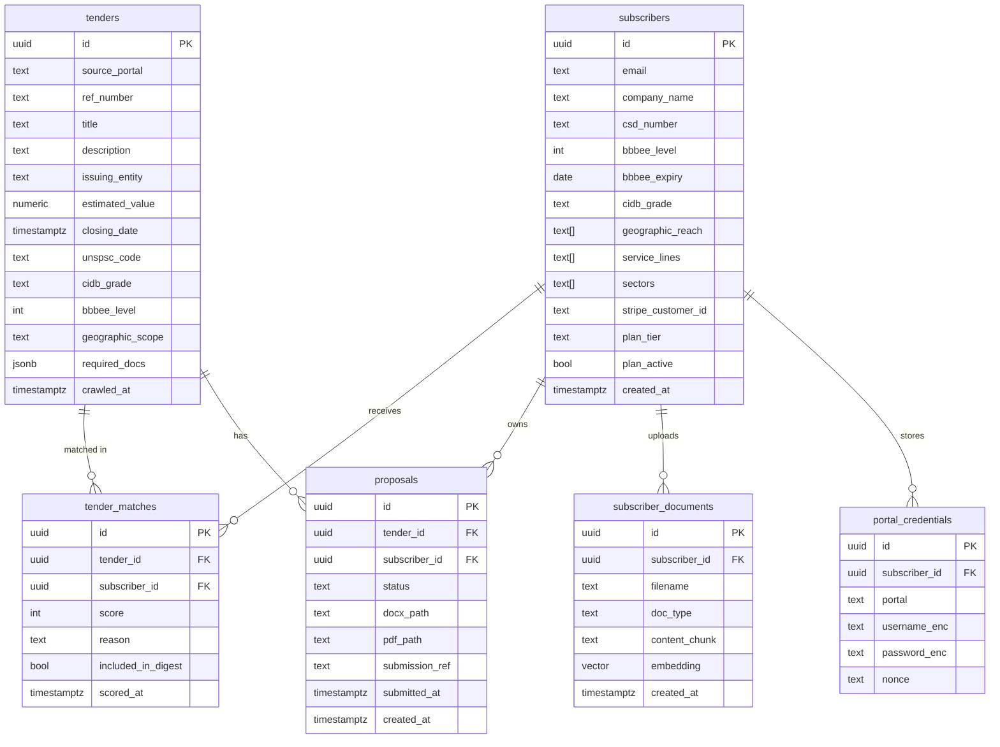
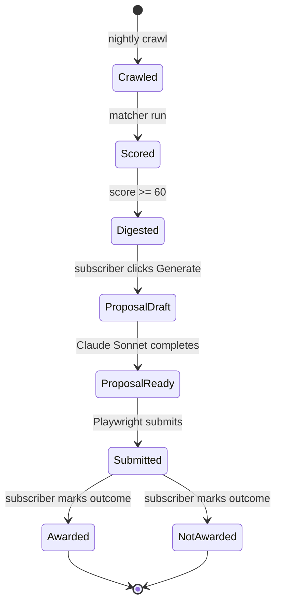
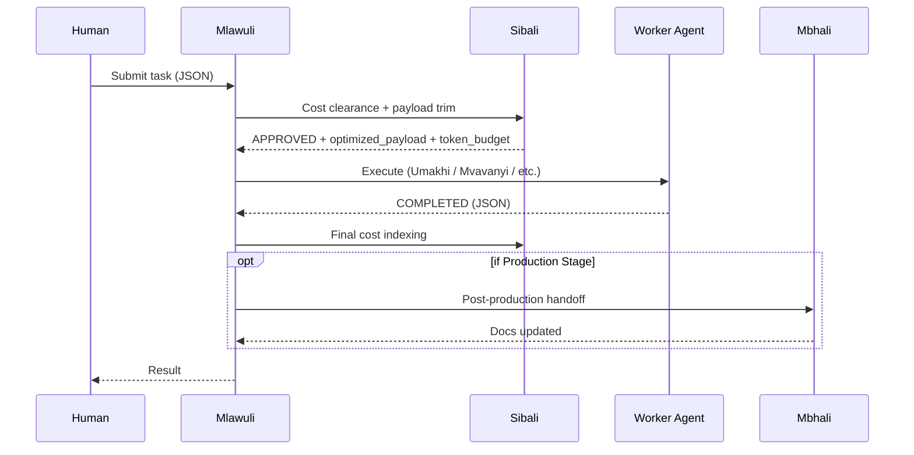

# GovTender — System Architecture (Mermaid Diagrams)

*Maintained by Mbhali. Updated on every production delivery.*

---

## 1. Full System Flow

---

## 2. Database Schema

---

## 3. Tender Lifecycle State Machine

---

## 4. API Routes

| Method | Path | Auth | Description |
|--------|------|------|-------------|
| GET | /health | None | Liveness probe |
| POST | /auth/login | None | Issue JWT |
| GET | /tenders | JWT | Paginated matched tenders for subscriber |
| GET | /tenders/{id} | JWT | Single tender detail + match reason |
| POST | /proposals/generate | JWT | Trigger proposal generation |
| GET | /proposals/{id} | JWT | Proposal status + download URLs |
| GET | /subscribers/profile | JWT | Read subscriber profile |
| PUT | /subscribers/profile | JWT | Update subscriber profile |
| POST | /subscribers/documents | JWT | Upload capability document |
| POST | /webhooks/stripe | Stripe-sig | Subscription lifecycle events |

---

## 5. Agent Workforce Flow (per task)

