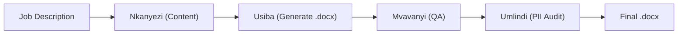

# JS Resume — Architecture

## Folder Structure

```
job_applications/
  <Company>_<Role>/
    Jubhele_Shange_<Company>_Cover_Letter.docx
    Jubhele_Shange_<Company>_<Role>.docx
_backups/           — Timestamped backups before any edit
sessions/           — Session logs per application round
```

## Generation Pipeline


